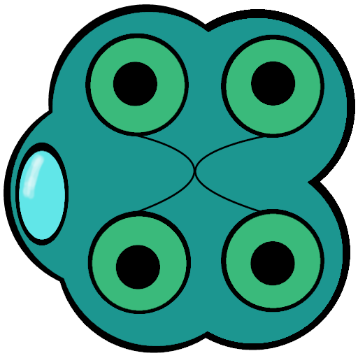

# A Fruitful Week

Well it certainly has been a productive week (hence, my delay in writing this)!  I promised mobs and ended with so much more.  My plab was to add a couple of extra enemies for protoyping.  I was thinking that I would make enough to complete a short, but satisfying game loop.  This would include some escalating difficulty, as well as additional enemy mechanics (like shooting bullets), and a BOSS.  Not only did I complete the short list of mobs, but I was also able to loosely tie them together to create a rudimentary game loop.

Now, I'm sure there are plenty of bugs I'm just not seeing yet.  I did find myself rushing through some of the building once I could "see the light" and I can guarantee there are mistakes that will come back to haunt me.  But, as we all know, "It works!" should always be the first real celebrated milestone and I feel like I've at least made it that far.

Anyway...  I promised some mobs so let's focus on those for a bit.  Keep in mind that while the art I share is placeholder, it still stays in the project spirit of NOT being AI generated.  I do apologize in advance for its obtrusive ugliness.

I started the project with two simple enemies:

&nbsp;&nbsp;&nbsp;&nbsp;&nbsp;&nbsp;&nbsp;&nbsp;&nbsp;&nbsp;&nbsp;&nbsp;&nbsp;&nbsp;&nbsp;

The code for these enemies and their behavior are pulled directly from the Godot 2D Tutorial thats provided in the documentation.  In fact, I completed the tutorial first and I continue to modify that same project (long story... different day perhaps).  For the first two enemies, I simply changed the speed and gave it a "faster looking" sprite.  But now, I had a list of enemies that was only going to grow larger and I needed a way to organize.  This led me to constructing an array to store my mob scenes in, but also I think I may have experienced my first real Godot hiccup.  For some reason, the engine did not really agree with declaring the array at the head of the script.  Because of this, I was not able to "drop" the needed scenes into the array.  I toiled with this issue for a couple days and eventually resolved it by just closing the scene and reopening once I had declared the array.  It makes sense that saving the scene would have sufficed, but the extra step was needed.

Either way, I now had the architecture I needed to house all manner of enemies I could muster.  So my next hurdle was to create a stationary mob that would shoot at the player.  This presented to problems to solve: the stationary enemy and its bullet.  

&nbsp;&nbsp;&nbsp;&nbsp;&nbsp;&nbsp;&nbsp;&nbsp;&nbsp;&nbsp;&nbsp;&nbsp;&nbsp;&nbsp;&nbsp;  

The stationary part was easy, just zero out the speed variable.  Done.  For firing, I called a new animated sprite that made it appear an "eye" was opening prior to the bullet being shot (pictured above).  The bullet, itself, ended up being a little more trouble than I had anticipated.  The bullet getting caught on every single body in the scene, or its parent, or having its physics wildy adjusted for no apparent reason taught me loads about layers and collision masks.  I was then able to apply what I learned here to my final enemy.

The BOSS:

&nbsp;&nbsp;&nbsp;&nbsp;&nbsp;&nbsp;

For the boss, I wanted something new.  I didn't want it to spawn or move off-screen.  Because of this, I made a random path for the boss to follow.  I achieved this by placing several markers around the boss scene and having the boss pick a random marker every few seconds and move to it.  Then, I employed the same "bullet firing" technology that I was using for the sentry, allowing for something that looks similar to a carrier deplying ships.  I used the scouts from earlier as the player should understand these are fast moving ships that should be avoided.  

During testing of all these wonderful enemies and how to properly spawn them, it seemed increasingly necessary to cobble together some sort of progession so I could see it all play out.  Because of this, I essentially completed some basic progression through increasingly difficult enemies which ends in a score screen.  I think some may call that an actual game loop.  But we aren't there yet and I'll be talking about that game loop and leveling system in the next dev log.  Thaks for reading!

- Gruff

# Somehwere to Start - 9/6/26

So I guess I should start somewhere.  If anybody knows me, its most likely as a nutty old dude that pops up on Twitch and Youtube every once in awhile.  While this has been sufficient to a degree in filling my time, I have found that I start to go a little batty if I'm not creating.  That's not to say that streaming or making videos isn't creating, because it certainly is.  And I do plan on venturing back that way soon.  However, a void continued to reside in my thoughts.  I knew that, deep down, I wasn't making my own brain go "brrrr".  I had reached this mental euphoria in the past.  I knew it was attainable.  So I set out to rectify this problem and have landed back with an old friend, game development.  I had walked away, happily I might add, from game dev a few years ago.  I always seemed to have the same roadblocks during my dev process.  I was never happy enough with the music, even though I do consider myself at least a serviceable musician.  I was never elated with my art, even though games are released everyday that don't hold a candle to my stickpersons.

And then there's the giant elephant in the room, let's call her Claudette.  I'm an artist.  At least that's what I've always told people to excuse my less than stellar offerings.  How am I ever supposed to get out my masterpieces now when someone is constantly wanting to hold my brushes for me.  I thought creating the parts for my game without a robots help would be easy, but the most difficult task has ended up finding tools that don't get touched by AI whatsoever.  This all just ended up being a basket of excuses. 

Because **I WAS NEVER GOING TO KNOW IF I COULD IF I NEVER AT LEAST TRIED.**  This is a lesson we're taught at a pretty early age, right?  

"You miss 100% of the shots you don't take" -  Gretzky or Scott or whoever

And so I decided this wouldn't be me.  I want to take my shot.  My smallest worry is what product eventually surfaces from all this.  Will it even be playable, let alone fun?  I'm hoping so.  I believe that with my decade plus of being as much of a sponge as possible has prepared me for this.  And for myself, I won't use any generative AI.  I have discovered that it can at least be used as a Hall of Fame search aggregator.

## So what's next

So I have completed what I consider a "game loop".  This means that it can launch, enemies and players alike can be destroyed, there is an end game state, and it can be quit.  But, there isn't really a game.  Just some proof to myself that I could do a thing.  However, I do believe I'm now in a psoition to make it a game.  I have a couple of programming issues which I will be visiting the solutions for once I have them.   Over the last few days, I have implemented functionality that will allow me to add mobs in a modular fashion.  So this upcoming week is MOB WEEK.  I will be spending the week doing additional art/logic for mobs.  

Wish me luck!  See ya next week!

- Gruff 
